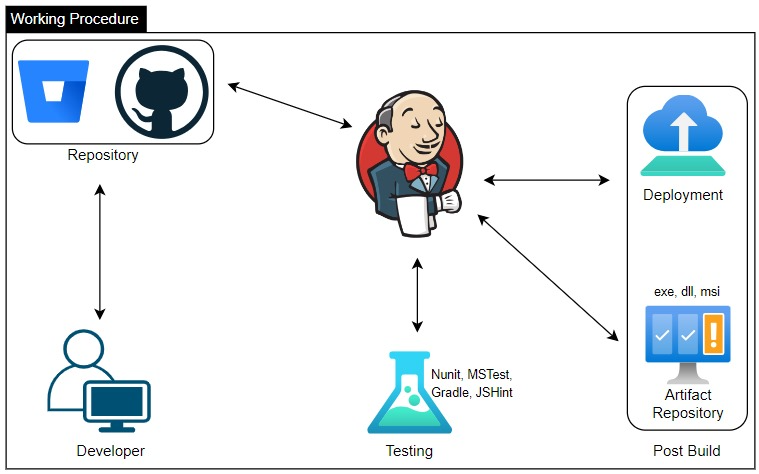

[![LinkedIn][linkedin-shield-lapissoft]][linkedin-url-lapissoft]
[![Facebook-Page][facebook-shield-lapissoft]][facebook-url-lapissoft]
[![Youtube][youtube-shield-lapissoft]][youtube-url-lapissoft]

## Visit Us [Lapis Soft](http://www.lapissoft.com)

### Get started with Jenkins

***Prerequisites***
To follow this tutorial, you will need:
1. Ubuntu Server 22.04 server configured with a non-root user and firewall.
2. OpenJDK 11 or upper

#### Java & OpenJDK Install
##### [Open JDK Install](https://jdk.java.net/21/)
```bash
apt install openjdk-21-jre-headless
find /usr/lib/jvm/java-21-openjdk-arm64/java* | head -n 3 # searching if required
nano .bashrc # or .bash_profile or .zshrc (mac)
JAVA_HOME=/usr/lib/jvm/java-21-openjdk-arm64 # set java path variable
PATH=$PATH:$HOME/bin:$JAVA_HOME/bin
export PATH
source .bashrc # or .bash_profile or .zshrc (mac)
java --version
echo $PATH
echo $JAVA_HOME
```

Or (my recommendation )

```bash
apt update
java -version
cd /opt
# as per your OS you should download specified version. my case aarch64.
wget https://download.java.net/java/GA/jdk21.0.2/f2283984656d49d69e91c558476027ac/13/GPL/openjdk-21.0.2_linux-aarch64_bin.tar.gz
tar zxvf openjdk-21.0.2_linux-aarch64_bin.tar.gz
mv jdk-21.0.2 jdk-21
whereis java # searching if required
nano .bashrc # or .bash_profile or .zshrc (mac)
JAVA_HOME=/opt/jdk-21 # set java path variable
PATH=$PATH:$HOME/bin:$JAVA_HOME/bin
export PATH
source .bashrc # or .bash_profile or .zshrc (mac)
java --version
echo $PATH
echo $JAVA_HOME
```

#### [Install](https://www.jenkins.io/doc/book/installing/linux/) Jenkins LTS.
```bash
wget -O /usr/share/keyrings/jenkins-keyring.asc \
  https://pkg.jenkins.io/debian-stable/jenkins.io-2023.key
echo deb [signed-by=/usr/share/keyrings/jenkins-keyring.asc] \
  https://pkg.jenkins.io/debian-stable binary/ | tee \
  /etc/apt/sources.list.d/jenkins.list > /dev/null
```
```bash
apt-get update
apt-get install jenkins
service jenkins status
```

Firewall Configuration
```bash
ufw allow 8080
ufw allow OpenSSH
ufw enable
ufw status
```

Use the following command to get the password
```bash
cat /var/lib/jenkins/secrets/initialAdminPassword
```
After getting the initial password and put required information & selecting plugins we will configure jenkins.
```bash
http://localhost:8080
```
if its need
```bash
apt apt upgrade jenkins-lts
```

Github
- install github plugin from plugin management
- configure from tool management

[Maven install](https://maven.apache.org/install.html)

cd /opt
```bash
wget https://dlcdn.apache.org/maven/maven-3/3.9.6/binaries/apache-maven-3.9.6-bin.tar.gz
tar zxvf apache-maven-3.9.6-bin.tar.gz 
mv apache-maven-3.9.6 maven
```

cd maven
```bash
nano .bashrc # or .bash_profile or .zshrc (mac)
M2_HOME=/opt/maven
M2=/opt/maven/bin
PATH=$PATH:$HOME/bin:$JAVA_HOME:$M2:$M2_HOME
export PATH
source .bashrc # or .bash_profile or .zshrc (mac)
echo $M2_HOME
mvn --version
```

#### [Install](https://gradle.org/install/) Gradle.
```bash
cd /opt
wget https://services.gradle.org/distributions/gradle-8.8-bin.zip
apt install unzip
unzip gradle-8.7-bin.zip
nano .bashrc
GRADLE_HOME=/opt/gradle-8.7 # gradle path variable
PATH=$PATH:$HOME/bin:$JAVA_HOME/bin:$M2:$M2_HOME:$GRADLE_HOME/bin
source /.bashrc
echo $GRADLE_HOME
gradle -v # check version
```

#### [Install](https://nodejs.org/en/download/prebuilt-binaries) NodeJS.
```bash
cd /opt
wget https://nodejs.org/dist/v20.12.0/node-v20.12.0-linux-x64.tar.xz
tar xf node-v20.12.0-linux-x64.tar.xz
mv node-v20.12.0-linux-x64 nodejs-20
nano .bashrc
# nodejs path variable
NODEJS_HOME=/opt/nodejs-20
PATH=$PATH:$HOME/bin:$JAVA_HOME/bin:$M2:$M2_HOME:$GRADLE_HOME/bin:$NODEJS_HOME/bin
source /.bashrc
echo $NODEJS_HOME
node -v # check version
```

- create maven app
- push to github & integrate to jenkins

### Working Principle



## Courtesy of Jakir

[![LinkedIn][linkedin-shield-jakir]][linkedin-url-jakir]
[![Facebook-Page][facebook-shield-jakir]][facebook-url-jakir]
[![Youtube][youtube-shield-jakir]][youtube-url-jakir]

### Have a good day, stay with me
<!-- Personal profile -->

[linkedin-shield-jakir]: https://img.shields.io/badge/linkedin-%230077B5.svg?style=for-the-badge&logo=linkedin&logoColor=white
[linkedin-url-jakir]: https://www.linkedin.com/in/jakir-ruet/
[facebook-shield-jakir]: https://img.shields.io/badge/Facebook-%231877F2.svg?style=for-the-badge&logo=Facebook&logoColor=white
[facebook-url-jakir]: https://www.facebook.com/jakir-ruet/
[youtube-shield-jakir]: https://img.shields.io/badge/YouTube-%23FF0000.svg?style=for-the-badge&logo=YouTube&logoColor=white
[youtube-url-jakir]: https://www.youtube.com/@mjakaria-ruet/featured

<!-- Company profile -->

[linkedin-shield-lapissoft]: https://img.shields.io/badge/linkedin-%230077B5.svg?style=for-the-badge&logo=linkedin&logoColor=white
[linkedin-url-lapissoft]: https://www.linkedin.com/company/lapis-soft/
[facebook-shield-lapissoft]: https://img.shields.io/badge/Facebook-%231877F2.svg?style=for-the-badge&logo=Facebook&logoColor=white
[facebook-url-lapissoft]: https://www.facebook.com/GoLapisSoft/
[youtube-shield-lapissoft]: https://img.shields.io/badge/YouTube-%23FF0000.svg?style=for-the-badge&logo=YouTube&logoColor=white
[youtube-url-lapissoft]: https://www.youtube.com/@LapisSoft/featured


